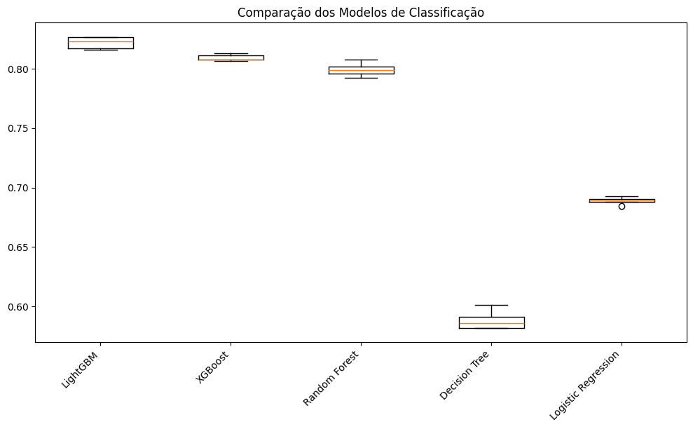
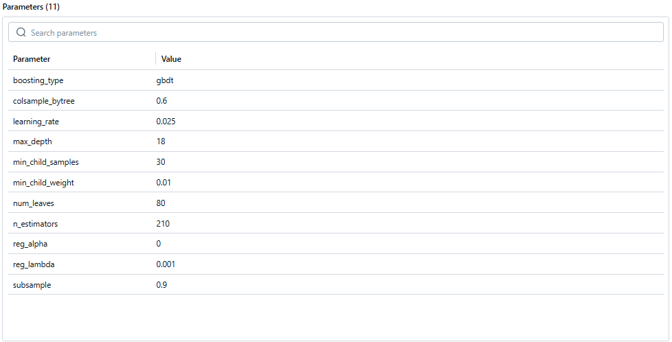
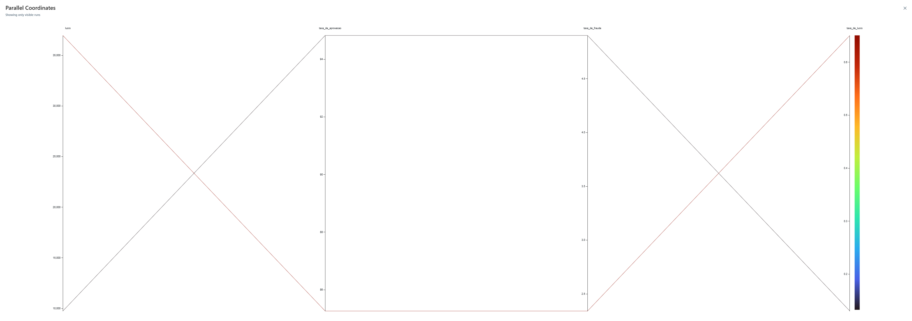
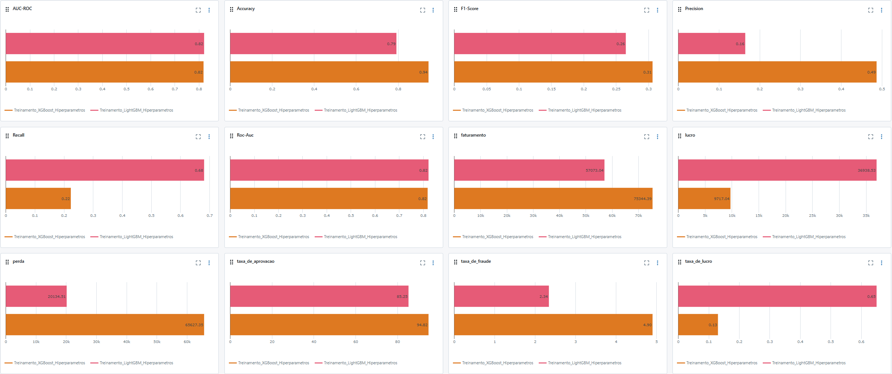

# Case Fraude

Este projeto tem como objetivo detectar fraudes em transações financeiras utilizando técnicas de aprendizado de máquina. O notebook `Case Fraude.ipynb` contém todo o fluxo de trabalho do projeto, incluindo a preparação dos dados, modelagem e avaliação dos modelos.

## Conteúdo

1. [Introdução](#introdução)
2. [Carregamento e Pré-processamento dos Dados](#carregamento-e-pré-processamento-dos-dados)
3. [Análise Exploratória dos Dados](#análise-exploratória-dos-dados)
4. [Engenharia de Features](#engenharia-de-features)
5. [Modelagem](#modelagem)
6. [Avaliação dos Modelos](#avaliação-dos-modelos)
7. [Conclusão](#conclusão)
8. [Referências](#referências)

## Introdução

As fraudes financeiras representam um desafio significativo para instituições financeiras e empresas em todo o mundo. Elas podem resultar em enormes perdas financeiras, danos à reputação e desconfiança dos clientes. Com o aumento das transações digitais, detectar e prevenir fraudes tornou-se ainda mais crucial. Utilizar técnicas de aprendizado de máquina para identificar padrões anômalos em transações pode fornecer uma defesa eficaz contra fraudes. Este projeto visa explorar e aplicar essas técnicas para melhorar a detecção de atividades fraudulentas, protegendo tanto as organizações quanto seus clientes. 

## Pré-processamento dos Dados

* Filtragem Geográfica: Foram selecionadas apenas transações realizadas no Brasil.

* Entrega de Documentos: Foram considerados como fraudes os casos em que os valores estavam ausentes na entrega dos documentos de 1 a 3.

* Transformação da Data da Transação: A data da transação foi desmembrada em três variáveis distintas: Hora da Compra, Dia do Mês e Dia da Semana. Essa separação foi feita para melhor compreender o comportamento dos fraudadores.

* Redução de Dimensionalidade: As variáveis Produto e Categoria Produto continham uma grande variedade de informações. Para reduzir a dimensionalidade e melhorar a análise, foi utilizado o método Target Encoder.

* Substituição de Valores Ausentes: Para as variáveis de score de 2 a 10, os valores ausentes foram substituídos pela mediana. Essa abordagem foi adotada devido à grande quantidade de outliers presentes nessas variáveis.

## Análise Exploratória dos Dados

* Distribuição de Fraudes: Apenas 5% dos dados representam transações fraudulentas.

* Score 1: Transações fraudulentas tendem a apresentar valores mais baixos para o score_1, indicando que um score_1 baixo pode ser um bom indicador de maior probabilidade de fraude.

* Score 2: Apesar de apresentar valores altos, o score_2 sozinho não é capaz de prever fraudes com precisão. Portanto, será necessário utilizar múltiplos scores e outros fatores no modelo de detecção de fraudes.

* Score 3: A média do score_3 é praticamente a mesma para fraudes e não fraudes, sugerindo que esta variável, isoladamente, pode não ser um forte discriminador entre as duas classes.

* Score 4: Quanto menor o score_4, maior a probabilidade de fraude, tornando-se um bom discriminador entre transações fraudulentas e não fraudulentas.

* Score 5: As diferenças nas distribuições (fraudulentas e não fraudulentas) sugerem que o score_5 tem um comportamento distinto nas fraudes, tornando-se uma variável importante para o modelo de detecção de fraudes.

* Score 6: A diferença nas distribuições sugere que o score_6 pode ser um bom discriminador entre transações fraudulentas e não fraudulentas, com pontuações mais baixas associadas a um risco maior de fraude.

* Score 7: A maioria dos valores de score_7 está concentrada nos intervalos mais baixos, com a cauda se estendendo para valores mais altos.

* Score 8: O score_8 apresenta uma distribuição aproximadamente uniforme, com frequências relativamente constantes ao longo da faixa de valores.

* Score 9: A tendência de fraudes apresentarem scores_9 mais baixos pode ser explorada no modelo de detecção, ajudando a identificar transações suspeitas.

* Score 10: A presença de picos em 0 e a ligeira diferença na média entre fraudes e não fraudes indicam que quanto menor o score_10, maior a probabilidade de fraude.

* Documentos Não Entregues: Transações onde o documento 1 não foi entregue (0) apresentam uma taxa de fraude significativamente maior (16.16%) em comparação às transações onde o documento foi entregue (1), com uma taxa de fraude de apenas 4.30%. Quando o documento 3 não é entregue (0), a taxa de fraude é de 8.18%, enquanto a entrega do documento 3 (1) reduz a taxa de fraude para 3.28%.

* Horário da Transação: Entre 0h e 4h, as fraudes são significativamente mais altas, com picos às 2h (19.65%) e 3h (15.68%), sugerindo que a madrugada é um horário de maior risco para fraudes.

## Engenharia de Features

* Criação de Variáveis Lag: Foram criadas variáveis "lag" para capturar o comportamento histórico das transações. Por exemplo, a data da transação foi desmembrada em Hora da Compra, Dia do Mês e Dia da Semana. Essas variáveis permitem analisar padrões temporais que podem ser indicativos de fraudes.

* Transformação de Variáveis: Transformações foram realizadas em diversas variáveis para melhorar a análise. Exemplos incluem:

    * Target Encoder: Utilizado nas variáveis Produto e Categoria Produto, devido à alta dimensionalidade dessas variáveis. O Target Encoder ajudou a reduzir a complexidade sem perder informações relevantes.

    * Substituição de Valores Ausentes: Para as variáveis de score de 2 a 10, os valores ausentes foram substituídos pela mediana para lidar com a grande quantidade de outliers, melhorando a robustez das análises.

* Amostragem Estratificada: Devido à baixa proporção de fraudes (apenas 5%), foi realizada uma amostragem estratificada. Essa técnica assegura que as diferentes classes estejam representadas de maneira proporcional no conjunto de dados de treinamento e teste, melhorando a precisão do modelo de detecção de fraudes.

* Modelo de Regressão Logística: Foi treinado um modelo de regressão logística para analisar o sumário e identificar variáveis que não influenciam significativamente no modelo (P>0.05). Essas variáveis foram removidas para simplificar o modelo e melhorar sua eficiência sem comprometer a precisão.

## Modelagem

Vários modelos de aprendizado de máquina foram treinados para identificar o que apresentava o melhor desempenho na detecção de fraudes. Os modelos avaliados incluem:

* LightGBM (Light Gradient Boosting Machine)

* XGBoost (Extreme Gradient Boosting)

* Random Forest

* Decision Tree

* Logistic Regression

Cada modelo foi treinado e avaliado com base em seu desempenho, a fim de determinar qual seria o mais eficaz para o problema de detecção de fraudes.

Após uma análise detalhada dos resultados, o modelo LightGBM foi selecionado devido ao seu desempenho superior. O LightGBM não só demonstrou maior capacidade preditiva como também eficiência computacional em relação aos outros modelos testados.

Para otimizar os hiperparâmetros do LightGBM e garantir o melhor desempenho possível, foi utilizada a técnica de Random Search. Esta técnica permite explorar uma grande quantidade de combinações de hiperparâmetros de forma eficiente, encontrando as configurações que maximizam o desempenho do modelo.

Esta abordagem garantiu a construção de um modelo de detecção de fraudes robusto e preciso, apto a identificar transações fraudulentas com alta eficácia.

* Melhores Hiperparametros encontrados:

## Avaliação dos Modelos

* Curva ROC (Receiver Operating Characteristic): A área sob a curva (AUC) melhorou de 0.78 no modelo atual para 0.82 no modelo treinado com LightGBM. Essa melhoria significativa indica que o novo modelo é mais eficaz em distinguir entre transações fraudulentas e não fraudulentas, resultando em uma detecção de fraudes mais precisa e redução de falsos positivos e falsos negativos.

* Melhoria Geral na Acurácia: O modelo LightGBM mostrou uma melhora na acurácia geral, passando de 0.80 para 0.85.

* Performance para Transações Não Fraudulentas: Embora a precisão (precision) e o F1-Score sejam ligeiramente menores no LightGBM, o recall é significativamente maior (0.87 vs. 0.81). Isso indica que o modelo LightGBM é mais eficaz em capturar transações não fraudulentas, resultando em menos falsos negativos.

* Detecção de Fraudes: A precisão (precision) e o F1-Score para fraudes aumentaram no LightGBM (precision: 0.20 vs. 0.16, F1-Score: 0.30 vs. 0.26). No entanto, o recall caiu um pouco (0.58 vs. 0.69). Embora haja uma leve diminuição no recall, a melhoria na precisão e no F1-Score sugere que o modelo está melhor em reduzir falsos positivos.

### Comparação Financeira

|  Modelo                  | Threshold | Perda      | Faturamento | Lucro      |
|--------------------------|-----------|------------|-------------|------------|
| **Atual**                | 73.000    | 19,811.050 | 55,751.644  | 35,940.594 |
| **Novo Modelo (LightGBM)** | 59.000    | 20,134.510 | 57,073.044  | 36,938.534 |

Comparando os resultados financeiros, o novo modelo LightGBM apresenta um aumento no lucro (de 35,940.594 para 36,938.534), apesar de um leve aumento na perda. O aumento significativo no faturamento contribuiu para essa melhoria geral no desempenho financeiro.

* Abaixo duas imagens mostrando a diferença do esultado entre os modelos LightGBM e XGBoost:

## Conclusão

Neste projeto, realizamos uma análise detalhada das transações para detectar fraudes. Utilizamos técnicas avançadas de engenharia de features, como a criação de variáveis lag, transformação de variáveis e oversampling com SMOTE, para melhorar a qualidade dos dados e preparar um modelo de detecção de fraudes robusto.

1. Após treinar e avaliar diversos modelos de aprendizado de máquina, o LightGBM se destacou como o melhor desempenho. As principais métricas de desempenho mostraram melhorias significativas:

* Acurácia Geral: Aumentou de 0.80 para 0.85.

* Taxa de Aprovação: Subiu de 79% para 84.5%.

* Curva ROC (AUC): Melhorou de 0.78 para 0.82.

Além disso, o modelo LightGBM demonstrou uma maior capacidade de detectar fraudes e reduzir falsos positivos, resultando em um aumento no lucro, de 35,940.594 para 36,938.534.

2. Para continuar melhorando a detecção de fraudes, consideramos algumas abordagens futuras:

* Incorporação de Novos Dados: Incluir novas variáveis e fontes de dados que possam fornecer informações adicionais sobre transações fraudulentas.

* Aprimoramento de Algoritmos: Testar e implementar algoritmos mais avançados e técnicas de ensemble para melhorar ainda mais o desempenho do modelo.

* Otimização Contínua: Realizar uma otimização contínua dos hiperparâmetros e ajustes finos no modelo para garantir que ele se adapte às mudanças nos padrões de fraude.

3. Próximos Passos

* Implementação do Modelo: Implementar o modelo LightGBM no sistema de produção para monitorar e detectar fraudes em tempo real.

* Monitoramento e Avaliação: Estabelecer um processo de monitoramento contínuo do desempenho do modelo e realizar ajustes conforme necessário.

* Feedback e Melhoria: Coletar feedback dos usuários e partes interessadas para identificar áreas de melhoria e ajustar o modelo conforme necessário.

## Referências

Liste as principais referências utilizadas no projeto, incluindo artigos, documentação de bibliotecas e outros recursos relevantes.

